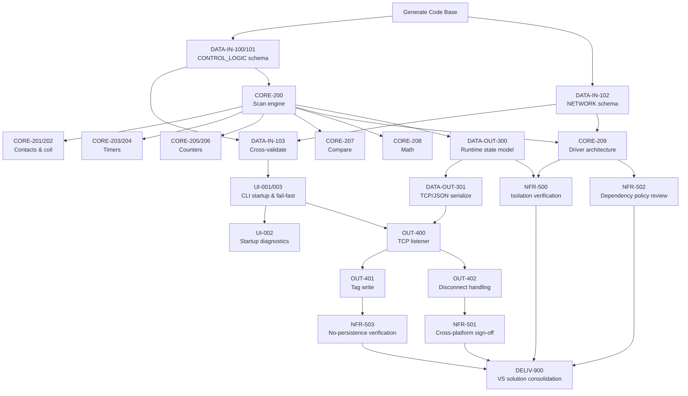

# Implementation Plan

<!--
Owned by the Systems Engineer, built in collaboration with Solutions
Architect's docs/PROJECT_DEFINITION.md. Sequences the build so the
most critical MVP items come first.
-->

## Build Sequence

A single linear priority order is sufficient here — nothing in
`docs/PROJECT_DEFINITION.md` calls for the multi-phase
(complexity/UI/documentation-rigor) breakdown; this is a single MVP
delivered as one coherent build, not a product growing through
distinct client-visible phases. Order below is most-critical-MVP-first
by technical dependency (Solutions Architect input) and client value
(Product Manager input — the scan-cycle engine and instruction set are
the emulator's actual value proposition per SN-1, so they're sequenced
ahead of CLI polish and network I/O, not after). RTVM items are grouped
into one issue where tightly related (same schema, same instruction
family); each still keeps its own RTVM ID in the RTVM and traces to its
own test procedure(s).

Real prerequisite structure (declared per-issue as Finish-Start/
Start-Start — see `.github/AGENT_LABELS.md`) allows a good deal of
this to run concurrently once unblocked; the numbering below is
priority order, not a strict serial gate.

1. **Generate Code Base** — `.sln`/`.csproj` scaffolding
   (`PlcEmulator.Host/Config/Core/Drivers/Network`). No dependencies;
   everything else depends on it.
2. **[DATA-IN-100/101] CONTROL_LOGIC schema** — tag data model
   (`BOOL`/`DINT`/`REAL`, timer/counter sub-elements) + rung/
   instruction list parsing.
3. **[DATA-IN-102] NETWORK schema** — component/driver-reference/tag-
   binding parsing. Independent of #2's internals; both only need
   Generate Code Base.
4. **[DATA-IN-103] Cross-file parse & validation** — ties #2 and #3
   together into one validated in-memory model.
5. **[CORE-200] Scan-cycle engine** — the core evaluation loop; the
   single most important piece of client value (SN-1). Needs only the
   tag/rung model from #2, not the full loader — sequenced right
   behind it rather than behind CLI/network plumbing.
6. **[CORE-201/202] Contacts & coil** (`XIC`, `XIO`, `OTE`).
7. **[CORE-203/204] Timers** (`TON`, `TOF`).
8. **[CORE-205/206] Counters** (`CTU`, `CTD`, `RES`).
9. **[CORE-207] Compare instructions** (`EQU`/`NEQ`/`GRT`/`LES`/`GEQ`/`LEQ`).
10. **[CORE-208] Math instructions** (`ADD`/`SUB`/`MUL`/`DIV`).
11. **[CORE-209] Driver architecture** (`IDriver`, built-in drivers)
    — needs both the scan loop (#5) and the NETWORK schema (#3).
12. **[UI-001/003] CLI startup & fail-fast validation** — wraps #4's
    loader in the Host composition root.
13. **[UI-002] Startup diagnostics** — reporting on top of #12's
    successful load path.
14. **[DATA-OUT-300] Runtime state model** — queryable end-of-scan tag
    state, built on #5's scan loop.
15. **[DATA-OUT-301] TCP/JSON serialization** of #14's state.
16. **[OUT-400] TCP listener / single-client** — needs #15 to serialize
    the initial snapshot on connect, and #12 since the Host wires the
    server up at startup.
17. **[OUT-401] Tag-write handling** — client → server writes on #16's
    connection.
18. **[OUT-402] Disconnect handling** — on #16's connection lifecycle.
19. **[NFR-500] Multi-controller isolation verification** — design-
    review/unit-test confirmation once the full controller (#11
    drivers, #14 state) exists.
20. **[NFR-501] Cross-platform parity — consolidated sign-off.** Per
    `docs/SDD.md`'s explicit decision, Windows/Linux parity is already
    gated continuously (CI runs both runners on every feature above);
    this item is the final consolidated RTVM confirmation once the
    full feature set (#18) is in place, not new verification work.
21. **[NFR-502] Dependency-policy review** — inspection of package
    references once the driver layer (#11), the most likely place a
    third-party dependency would be reached for, exists.
22. **[NFR-503] No-persistence-across-restart verification** — needs a
    running write path (#17) to set state, stop, and restart against.
23. **[DELIV-900] Visual Studio solution consolidation** — explicitly
    late-stage per `docs/PROJECT_DEFINITION.md`'s Deliverable
    Requirements and `docs/SDD.md`'s Build & Toolchain Conventions: a
    verification/cleanup pass, not a structural rewrite, run only once
    the rest of the functional and NFR build (#19–#22) is complete.

## Sequence Diagram

