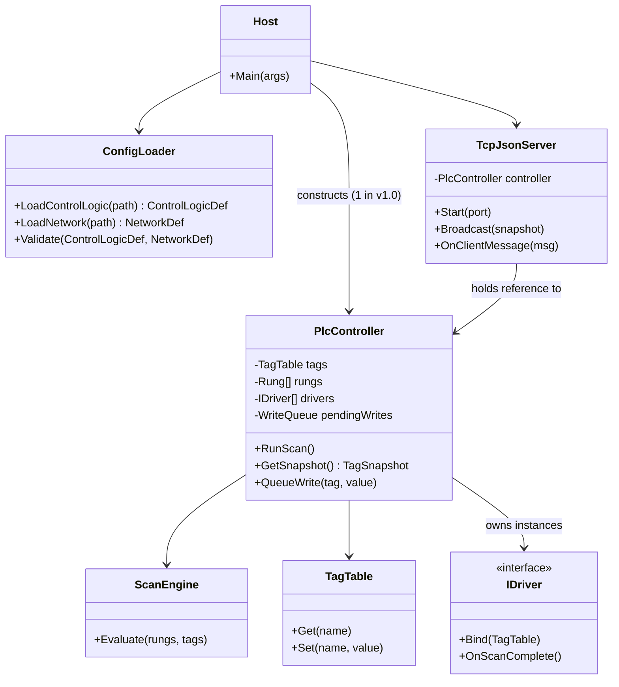
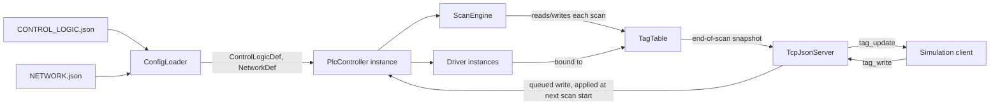
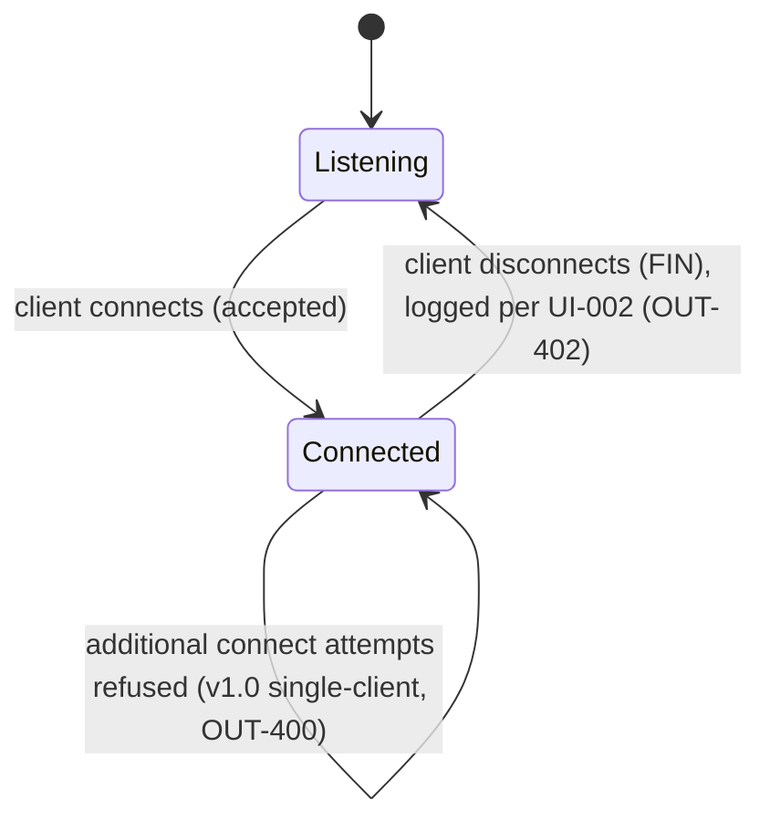

# Software Design Document (SDD)

<!--
Owned by the Systems Engineer, refined with the Software Engineer.
Describes the system architecture and the build/toolchain
conventions the codebase follows.
-->

## Architecture

The system is a single OS process (`plcemu`, a cross-platform CLI
server) composed of five collaborating parts. Everything downstream of
the composition root is built around one core design decision, driven
by NFR-500: **all mutable runtime state for a PLC lives inside an
instantiable `PlcController` object, never behind a static/singleton
field.** Nothing else in this architecture depends on there being
exactly one controller — v1.0 simply chooses to construct and wire up
one.

- **Host (composition root).** Parses CLI arguments (UI-001), invokes
  the Config Loader, constructs one `PlcController` from the resulting
  definitions, constructs one `TcpJsonServer` bound to that
  controller, and starts both. Owns startup diagnostics (UI-002) and
  fail-fast error handling (UI-003) — nothing below the Host swallows
  a load error into a partially-started state.
  **Added 2026-08-17 (OUT-403, issue #29/#30):** Host also owns the
  free-running background scan loop — after `TcpJsonServer.Start()`
  succeeds, Host repeatedly calls `controller.RunScan()` back-to-back
  (no artificial delay, consistent with the Scan Engine's own
  elapsed-time design below) and calls `server.Broadcast(controller.GetSnapshot())`
  after each scan, instead of just blocking forever. This lives on the
  Host, not on `TcpJsonServer` — the server's job is the client
  protocol/connection lifecycle, not deciding when a scan runs. (An
  earlier `Program.cs` comment claimed this loop belonged to
  `TcpJsonServer`; that was never actually implemented anywhere and is
  corrected by this note.)
- **Config Loader / Validator.** Parses CONTROL_LOGIC and NETWORK JSON
  into immutable definition objects (`ControlLogicDef`, `NetworkDef`),
  including cross-file validation (DATA-IN-103). Produces either a
  fully valid definition pair or a descriptive error; never a partial
  result.
- **PlcController.** The unit of isolation. Holds one controller's
  `TagTable` (DATA-OUT-300), its parsed rung program, its instantiated
  driver set, and its incoming-write queue. Exposes `RunScan()`,
  `GetSnapshot()`, and `QueueWrite(tag, value)`. Two `PlcController`
  instances constructed side by side in the same process share no
  mutable state — each owns its own tag table, driver instances, and
  scan state. This is what makes NFR-500 an architectural property
  rather than a v1.0 implementation detail: v1.0's Host simply chooses
  to construct exactly one.
- **Scan Engine.** Owned by (not shared across) a `PlcController`.
  Evaluates rungs in program order once per scan (CORE-200), updating
  the owning controller's `TagTable` before the next scan begins.
  Instruction classes (`XIC`, `OTE`, `TON`, `CTU`, etc.) are stateless
  evaluators operating on the tag table passed to them — no
  instruction class holds tag state itself, so the same instruction
  logic is reused correctly across multiple controller instances.
  **Confirmed 2026-08-16 (issue #9):** each instruction also receives
  the accumulated rung power-flow state ("rung-condition-in") and
  returns it forward ("rung-condition-out") — see Coding Standards
  below for the `IInstruction.Evaluate` signature this implies. Seeded
  `true` (energized from the left power rail) at the start of every
  rung by the Scan Engine and not carried across rungs; still fully
  stateless per-call, so the reuse property above is unaffected.
  **Confirmed 2026-08-16 (issue #11):** each instruction also receives
  the real (wall-clock) time elapsed since the previous scan, for
  time-driven instructions (`TON`/`TOF`, CORE-203/204) to accumulate
  `.ACC` against — v1.0 does not define a fixed scan period, so the
  Scan Engine measures actual elapsed time itself (a `Stopwatch` field
  on `ScanEngine`, restarted every call) rather than assuming an
  idealized one; `TimeSpan.Zero` on a controller's first scan, since
  there is no previous scan to measure from. This is state on
  `ScanEngine` itself (already documented above as owned by, not
  shared across, a `PlcController`), not on any instruction, so
  instruction classes remain fully stateless per-call.
- **Driver layer.** NETWORK-defined components are instantiated
  through a common `IDriver` interface (CORE-209) and bound to their
  owning controller's `TagTable` at construction — never to a global
  registry. Adding a new component type means implementing `IDriver`;
  it never requires touching the Scan Engine or instruction classes.
- **TCP/JSON Server.** Wraps exactly one `PlcController` reference in
  v1.0 and enforces the single-client constraint (OUT-400) at the
  listener, not inside the controller — the controller itself has no
  concept of "the" client. This keeps the single-client rule a v1.0
  Host/Server policy, not a structural limit on `PlcController`.

### Component Architecture

Structural decomposition (block definition):



Signal/data flow at runtime (internal block view):



Note the write path: `tag_write` messages are queued by the server and
drained by `PlcController` at the start of its own scan, not applied
directly to `TagTable` from the network thread — this is what keeps
scan evaluation single-threaded and avoids introducing shared mutable
state between the I/O thread and the scan loop (reinforcing NFR-500's
"no shared mutable state" property at the threading level, not just
the controller level).

## Coding Standards

Established here; open to refinement with the Software Engineer as
implementation surfaces real questions — flag anything that doesn't
fit cleanly.

- **Namespaces / project layout:** `PlcEmulator.Host`,
  `PlcEmulator.Config`, `PlcEmulator.Core` (`TagTable`, `ScanEngine`,
  instructions, **and the `IDriver` interface itself** —
  `PlcEmulator.Core.Drivers.IDriver` — since `PlcController`/`TagTable`
  in `Core` are what drivers bind against; declaring the interface in
  `Drivers` instead would make `Core` and `Drivers` depend on each
  other, which .NET project references can't express), `PlcEmulator.Drivers`
  (built-in `IDriver` implementations only — `DiscreteSensorDriver`,
  `RelayDriver`, etc.), `PlcEmulator.Network` (TCP/JSON server, message
  schema). One project per namespace root, referenced from a top-level
  `PlcEmulator.sln`. **Confirmed 2026-08-16 (issue #5):** this
  standard dependency-inversion placement (interface next to its
  consumer, implementations in the leaf project) is correct and
  doesn't weaken CORE-209 — "add a driver without touching the Scan
  Engine or instruction classes" still holds, since adding a driver
  only ever touches `PlcEmulator.Drivers`.
- **Naming:** standard .NET conventions — `PascalCase` for
  types/public members/methods, `camelCase` for locals/parameters,
  `_camelCase` for private instance fields. Ladder-logic domain names
  (tag names, instruction mnemonics) are preserved verbatim from
  CONTROL_LOGIC JSON (`XIC`, `OTE`, `TON`, etc.) rather than translated
  into more "C#-ish" names — the client's engineers already think in
  Rockwell mnemonics (SN-3).
- **Tag data model:** `TagType` enum (`Bool`, `Dint`, `Real`); a `Tag`
  class holding a value plus optional structured sub-elements
  (`TimerState { Pre, Acc, Dn, En }`, `CounterState { Pre, Acc, Dn, Cu,
  Cd }`) per DATA-IN-100. **Confirmed 2026-08-17 (issue #12, CORE-205/
  206):** `Cu`/`Cd` are runtime-only edge-memory bits (was the enable
  input true last scan, per instruction type) added so `CTU`/`CTD`
  can detect a rising edge without instructions themselves holding
  state, which "Instruction classes" below requires them to stay
  free of. Two independent bits, not one, because a `CTU` and a `CTD`
  can legally target the same counter tag (an up/down counter pair)
  and each needs its own edge memory — mirrors the real Rockwell
  `COUNTER` data type's status word. Not exposed in CONTROL_LOGIC
  JSON; DATA-IN-100's schema (`.PRE`/`.ACC`/`.DN` as authored fields)
  is unchanged.
- **Instruction classes:** one class per mnemonic under
  `PlcEmulator.Core.Instructions`, each implementing a shared
  `IInstruction.Evaluate(TagTable tags, bool rungState, TimeSpan elapsed)` — stateless,
  operating only on the tag table and rung state it's given (see
  Architecture above — this is what keeps instruction logic reusable
  across isolated controller instances). **Confirmed 2026-08-16
  (issue #9), superseding the single-parameter signature originally
  documented here:** `rungState` carries standard ladder-logic
  rung-condition-in/rung-condition-out power flow — condition-type
  instructions (contacts, compares) AND their own tag-based condition
  into the value they're given and return the result; action-type
  instructions (coils, timers, counters, math) consume it to decide
  their side effect and pass it through unchanged. Without this, an
  output instruction like `OTE` would have no way to know whether the
  contacts preceding it in the same rung were true. `ScanEngine` seeds
  `rungState = true` (energized from the left power rail) at the start
  of every rung. **Confirmed 2026-08-16 (issue #11), adding a third
  parameter to the signature above:** `elapsed` carries the real
  (wall-clock) time since the previous scan (`TimeSpan.Zero` on a
  controller's first scan) — used only by time-driven instructions
  (`TON`/`TOF`, CORE-203/204) to accumulate `.ACC`; every other
  instruction ignores it. See Architecture above for why `ScanEngine`
  measures this itself rather than v1.0 defining a fixed scan period.
- **Driver interface:** `IDriver.Bind(TagTable tags, NetworkComponentConfig config)`
  at construction, `IDriver.OnScanComplete()` called once per scan
  after tag values settle, for drivers that need to react to state
  changes (e.g. a sensor driver recomputing a derived reading).
- **Error handling:** load-time errors (UI-003, DATA-IN-103) throw
  descriptive exceptions caught once at the Host boundary and reported
  as non-zero exit + stderr message; the Scan Engine never throws for
  expected runtime conditions like divide-by-zero (CORE-208) — those
  set a fault flag on the offending tag/instruction result instead, so
  a single bad rung can't crash the scan loop.
- **Documentation:** public types/members get XML doc comments —
  required reading for the client's own engineers extending the
  codebase later (SN-5, DELIV-900).

## Build & Toolchain Conventions

- **Runtime/language:** C# on .NET 8 (LTS) — long support window,
  first-class cross-platform (Windows + Linux) support, native
  SDK-style project files.
- **Project structure:** SDK-style `.csproj` per namespace root (see
  Coding Standards) referenced from one `PlcEmulator.sln` at the repo
  root, generated with `dotnet new`. SDK-style `.csproj`/`.sln` files
  are natively Visual Studio-compatible — day-to-day development does
  not need a separate "CLI project format" vs. "VS project format";
  there is one project structure throughout.
- **Day-to-day build/test:** `dotnet build`, `dotnet test`,
  `dotnet run` — no IDE requirement during development, per
  `docs/PROJECT_DEFINITION.md`'s Deliverable Requirements. CI (GitHub
  Actions, Ubuntu runner) uses these same commands.
- **Dependency policy (NFR-502):** no third-party NuGet packages by
  default. `System.Text.Json` (part of the .NET SDK, not a third-party
  package) is the JSON library for both config parsing and the
  TCP/JSON protocol. If a genuine third-party dependency is ever
  adopted, it is referenced only from a wrapper class behind an
  interface in the relevant namespace (e.g. an `IJsonCodec` wrapper if
  the built-in serializer ever needs replacing) — never called
  directly from `PlcEmulator.Core` or `PlcEmulator.Drivers`.
- **DELIV-900 (Visual Studio solution, late-stage task):** because the
  project already builds as SDK-style `.csproj`/`.sln` from day one,
  DELIV-900 is scheduled in the Implementation Plan as a
  **verification and cleanup** pass, not a structural rewrite:
  confirm the solution opens cleanly in Visual Studio, confirm no
  missing project references or CLI-only assumptions (e.g. hardcoded
  `/`-only paths — see NFR-501), and fix anything that surfaces. This
  keeps DELIV-900 cheap precisely because the toolchain decision above
  avoided a format mismatch to begin with. Development occurs entirely within the Github/Anthropic agentic pipeline's native environment (Ubuntu/.NET). Refactoring into a Visual Studio project is a final deliverable step, performed once, after v1.0 is functionally complete and tested — not verified continuously during development. No parallel Windows/MSVC verification pipeline runs per-feature.

### Target-platform verification strategy (explicit decision — revised 2026-08-16)

The agent pipeline executes on Ubuntu; the deliverable targets both
Windows and Linux (NFR-501) and, separately, must open in the Windows
Visual Studio IDE (DELIV-900) AFTER the final codebase for v1.0 is
tested and verified. **Client decision (2026-08-16, issue #5):**
development happens entirely in-pipeline (Ubuntu/.NET) throughout
v1.0. Both NFR-501 and DELIV-900 are verified together, once, as a
single late-stage consolidation pass — not per-feature. This
supersedes the earlier "NFR-501 gates every feature" split recorded
below in this section's original text; that split is kept struck
through for traceability rather than deleted, since it explains why
`docs/ci/windows-verification.yml` / `docs/ci/build-and-test.yml`
already exist as inert, undeployed files (see issue #5).

- **NFR-501 (Windows/Linux behavioral parity) and DELIV-900 (opens as
  a Visual Studio solution) are both one-time, late-stage
  consolidation tasks, not per-feature gates.** All `[RTVM-014]`-style
  feature work builds/tests only on `ubuntu-latest` throughout
  development. Once v1.0 is functionally complete and tested, a single
  consolidation issue runs `dotnet build` + `dotnet test` on
  `windows-latest` (NFR-501) and confirms the `.sln` opens/builds
  cleanly under Visual Studio (DELIV-900) in the same pass, fixing
  anything that surfaces (path separators, line endings, file locking,
  missing project references). `docs/ci/windows-verification.yml` and
  `docs/ci/build-and-test.yml` stay staged in `docs/ci/` — not copied
  into `.github/workflows/` — until that consolidation issue.
- **Why revised from a per-feature CI matrix:** the original reasoning
  (both runners are "nearly free" per feature on GitHub Actions) is
  true in isolation, but undercounts the recurring cost of a second
  execution environment's own setup/permission questions on *every*
  feature issue (e.g. issue #5's `workflows`-scope push rejection) —
  multiplying a one-time integration cost by the number of RTVM
  features, per the SDD's own platform-verification guidance. Ubuntu
  and Windows are also not expected to diverge much for this app (no
  native interop, `System.Text.Json` + framework-only path/IO code),
  so the risk of an OS-specific bug surfacing late and being
  hard-to-bisect is low relative to that recurring cost. Client
  confirmed this tradeoff explicitly on 2026-08-16.
- ~~NFR-501 gates every feature via a `ubuntu-latest` +
  `windows-latest` CI matrix; DELIV-900 is a one-time consolidation
  task~~ (superseded — see above).

## Data Architecture

This system has two communicating components in a single OS process
boundary each — the `plcemu` server process and an external
Unreal/Unity simulation client process — connected over a custom
TCP/JSON interface (OUT-400/401/402, DATA-OUT-300/301).

- **Transfer method:** a single persistent TCP connection per client.
  Because TCP is a byte stream, messages need explicit framing: each
  message is one **newline-delimited JSON object** (NDJSON) —
  `System.Text.Json` serializes to a single line, terminated by `\n`.
  Chosen over length-prefixed binary framing because it stays
  dependency-free, is trivially diagnosable with a raw TCP/telnet
  client during development and training use (SN-2), and message
  sizes here (a tag snapshot, a handful of writes) are small enough
  that framing overhead is a non-issue.
- **Ordering guarantees:** TCP already guarantees in-order, reliable
  delivery on a single connection, so no additional sequencing layer
  is needed. On the write path, `tag_write` messages are queued by the
  server as they arrive and drained by `PlcController` atomically at
  the start of its next scan (never mid-scan) — this guarantees a
  scan always sees a consistent set of inputs, and also means the
  network I/O thread never mutates `TagTable` directly (see
  Architecture above).
- **Storage:** none, by design (NFR-503). CONTROL_LOGIC and NETWORK
  JSON files are the only persisted state, read once at startup;
  `TagTable` and all driver state live in memory for the life of the
  process and are discarded on exit. There is no database, cache, or
  on-disk runtime state to reason about.

## CONTROL_LOGIC JSON Schema (DATA-IN-100/101)

The client's own engineers author CONTROL_LOGIC files by hand (SN-1,
SN-3), so it's specified here rather than left implicit in
`PlcEmulator.Config.ConfigLoader` (which is the normative
implementation — this section documents the shape it accepts,
introduced with DATA-IN-100/101; see `src/PlcEmulator.Config/ConfigLoader.cs`'s
XML doc for the same reference alongside the parsing code).

```json
{
  "tags": [
    { "name": "Start_PB", "type": "BOOL", "initialValue": false },
    { "name": "Preset_Count", "type": "DINT", "initialValue": 0 },
    { "name": "MyTimer", "type": "TIMER", "preset": 3000 }
  ],
  "rungs": [
    { "instructions": [
        { "op": "XIC", "operands": ["Start_PB"] },
        { "op": "OTE", "operands": ["Motor_Run"] }
    ] }
  ]
}
```

- **`tags`** — an array of tag definitions (DATA-IN-100). `type` is one
  of `BOOL`/`DINT`/`REAL` (scalar — requires `initialValue`: JSON
  `bool`/`number`/`number` respectively) or `TIMER`/`COUNTER`
  (structured — uses `preset` (a JSON number, → `.PRE`) instead;
  `.ACC`/`.DN`/`.EN` always start at their zero/false defaults, never
  independently configurable). Tag names must be unique within the
  file.
- **`rungs`** — an ordered array of rungs (DATA-IN-101), each an
  ordered array of `instructions`. Each instruction is `{"op":
  "<MNEMONIC>", "operands": [...]}`, mnemonic drawn from the MVP
  instruction set (contacts `XIC`/`XIO`, coil `OTE`, timers
  `TON`/`TOF`, counters `CTU`/`CTD`/`RES`, compare
  `EQU`/`NEQ`/`GRT`/`LES`/`GEQ`/`LEQ`, math `ADD`/`SUB`/`MUL`/`DIV`).
  `operands` is a uniform array where a JSON string is a tag reference
  and a JSON number is a literal — chosen over per-mnemonic field
  names (e.g. a `tag` field for contacts vs. a `dest` field for math)
  because it keeps the loader's parsing generic; exact arity per
  mnemonic (one tag for contacts/coil/timers/counters/`RES`, two
  tag-or-literal operands for compare, two tag-or-literal operands
  plus a destination tag for math) is enforced when the operand list
  is turned into a concrete instruction
  (`PlcEmulator.Core.Instructions.InstructionFactory`), not by the
  loader itself.
- **Validation:** `ConfigLoader.LoadControlLogic` rejects malformed
  JSON, an unrecognized `type`, a missing `initialValue`/type
  mismatch, and a duplicate tag name, each with a `ConfigValidationException`
  identifying the file and the problem (UI-003). Mnemonic legality and
  operand-arity errors surface slightly later, when
  `PlcEmulator.Core.ControlLogicBuilder` turns a loaded
  `ControlLogicDef` into a runtime `TagTable`/`Rung` program — still
  before a scan ever runs, so the effect (fail fast, descriptive
  error, no partial state) is the same either way.

## Interface Control Document (ICD): TCP/JSON Protocol

External simulation engines (Unreal/Unity) build against this
directly (SN-1, SN-3), so it's specified here rather than left
implicit in code.

**Transport:** one TCP connection, one message per line, UTF-8 JSON,
`\n`-terminated. Port is operator-configurable at startup (OUT-400,
e.g. `--port 5050`).

**Connection lifecycle:**



**Message types:**

| Type | Direction | Schema | Sent when |
| --- | --- | --- | --- |
| `tag_update` | Server → Client | `{"type":"tag_update","tags":{"<name>":<value>,...}}` | Immediately on connect (serves as the initial snapshot), and again after every scan cycle completes (DATA-OUT-301) |
| `tag_write` | Client → Server | `{"type":"tag_write","tags":{"<name>":<value>,...}}` | Any time the client wants to set input tag values (e.g. a simulated sensor state); applied at the start of the next scan (OUT-401) |
| `read_request` | Client → Server (optional) | `{"type":"read_request"}` | A one-shot client (e.g. a diagnostic/training tool, not a continuous simulation loop) explicitly asking for a snapshot outside the normal per-scan push |

Example exchange, matching RTVM test procedures TP-301/TP-401:

```
S→C: {"type":"tag_update","tags":{"Start_PB":false,"Motor_Run":false,"Preset_Count":0}}
C→S: {"type":"tag_write","tags":{"Start_PB":true}}
S→C: {"type":"tag_update","tags":{"Start_PB":true,"Motor_Run":true,"Preset_Count":0}}
```

`tags` values are JSON `bool` for `BOOL`, JSON `number` for `DINT`/
`REAL`. Structured tag sub-elements (`.PRE`/`.ACC`/`.DN`/`.EN`) are not
addressed individually over this interface in v1.0 — only their
parent tag's externally-relevant value is exposed; internal
timer/counter bookkeeping stays server-side. (Flagged in case a future
version needs sub-element visibility over the wire — not a v1.0 gap,
since no MVP scope item calls for it.)
